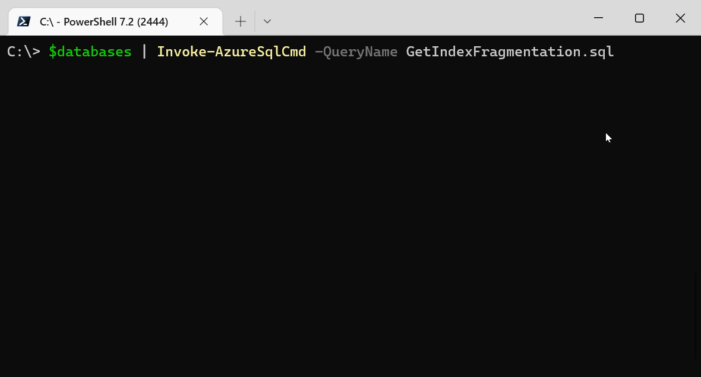

# Azure.Sql.Tools.Tasks

## Description

Azure SQL Tools Tasks is just a fun experiment based on Azure SQL Tools. The original project shows how to use native SQL files and SSO. Azure SQL Tools Tasks builds on that for running queries across multiple databases on the same server. The module will create 1 thread per elastic pool to avoid over utilization of resources. Another feature is the progress tracking bars even though they are running in different threads.

## Requirements

- Install the newest PowerShell - [Link](https://github.com/PowerShell/PowerShell#get-powershell)
- Install Azure PowerShell Module - [Link](https://docs.microsoft.com/en-us/powershell/azure/install-az-ps?view=azps-6.2.1)
- Connect Azure PowerShell - [Link](https://docs.microsoft.com/en-us/powershell/azure/get-started-azureps?view=azps-6.2.1)
- Add SqlServer Module

```powershell
# First time install
Install-Module SqlServer -Scope CurrentUser -Force

# Updating Module
Update-Module SqlServer -Scope CurrentUser -Force
```

## Getting Started with Azure.Sql.Tools.Tasks

### Importing the Module

```powershell
Import-Module ".\path\to\Azure.Sql.Tools.Tasks.psd1"
Get-Module
```

- Your output should have the following
  - Az.Accounts 2.4.0 or greater
  - Az.Resources 4.2.0 or greater
  - Azure.Sql.Tools.Tasks 0.0.1 or greater
  - SqlServer 21.1.18235 or greater

### Using the command

```powershell
$databases = Get-AzSqlDatabase -ResourceGroupName "MyResourceGroup" -ServerName "MyServerName"

$results = $databases | Invoke-AzureSqlCmd -QueryName GetDatabaseName.sql
```


